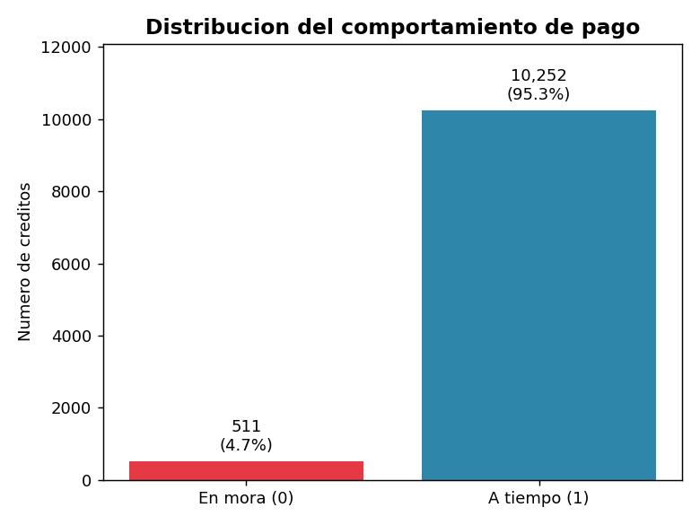
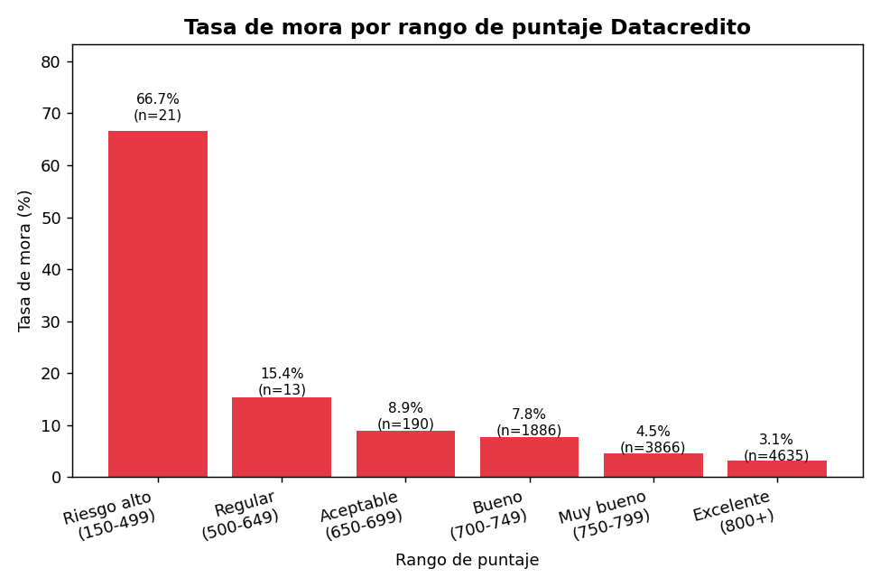
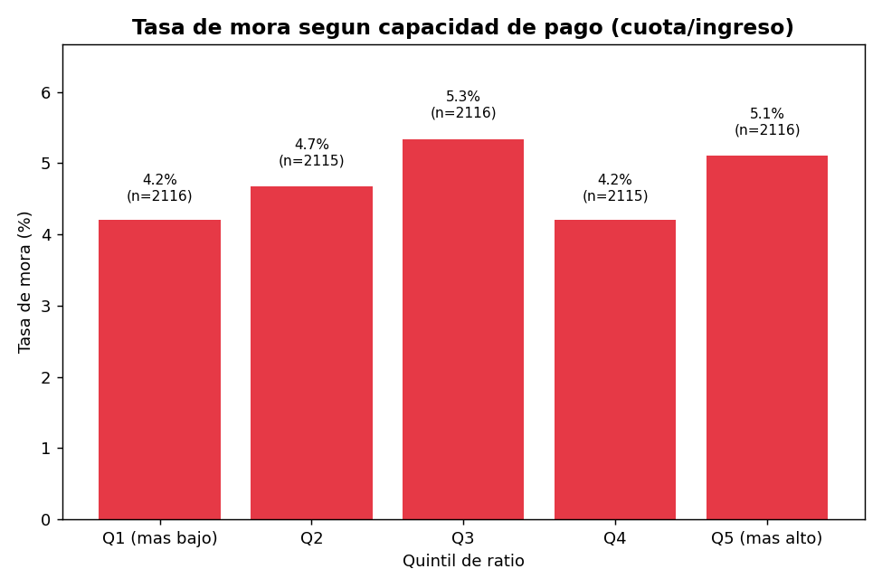
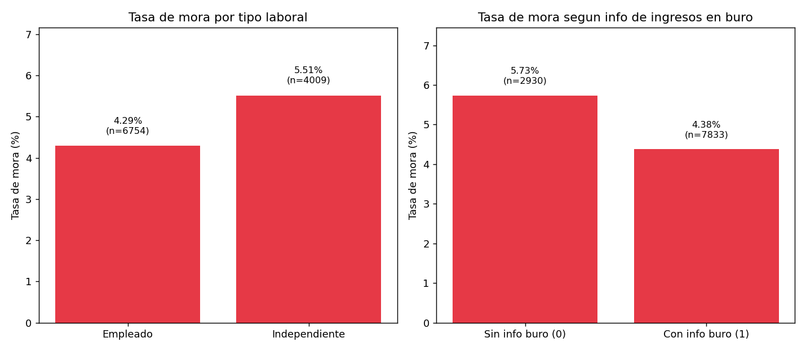
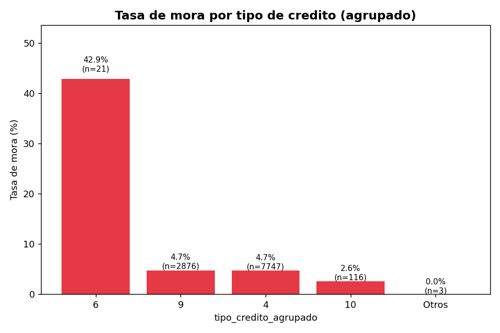
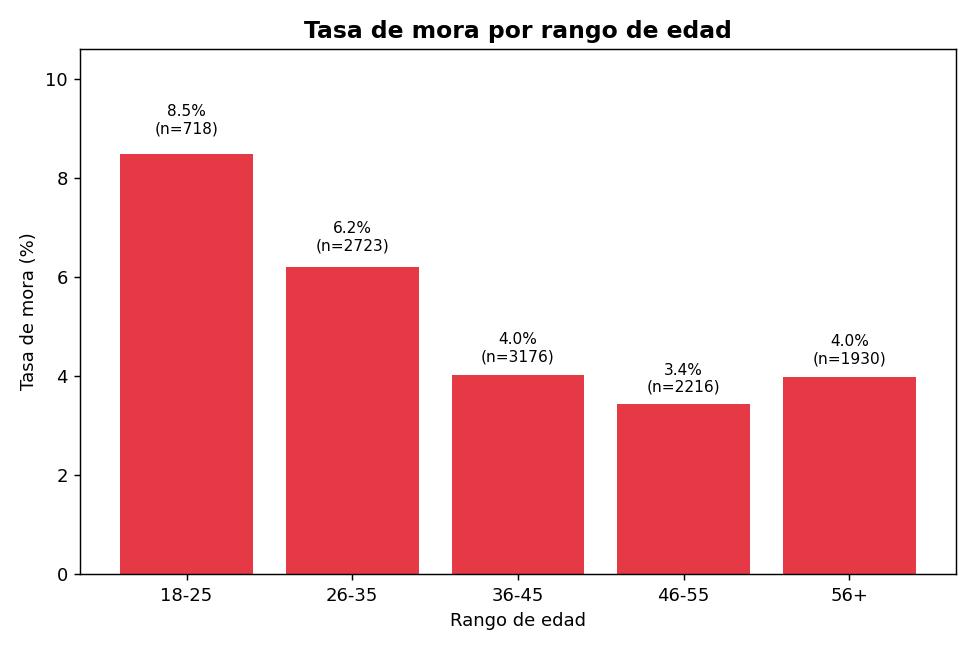
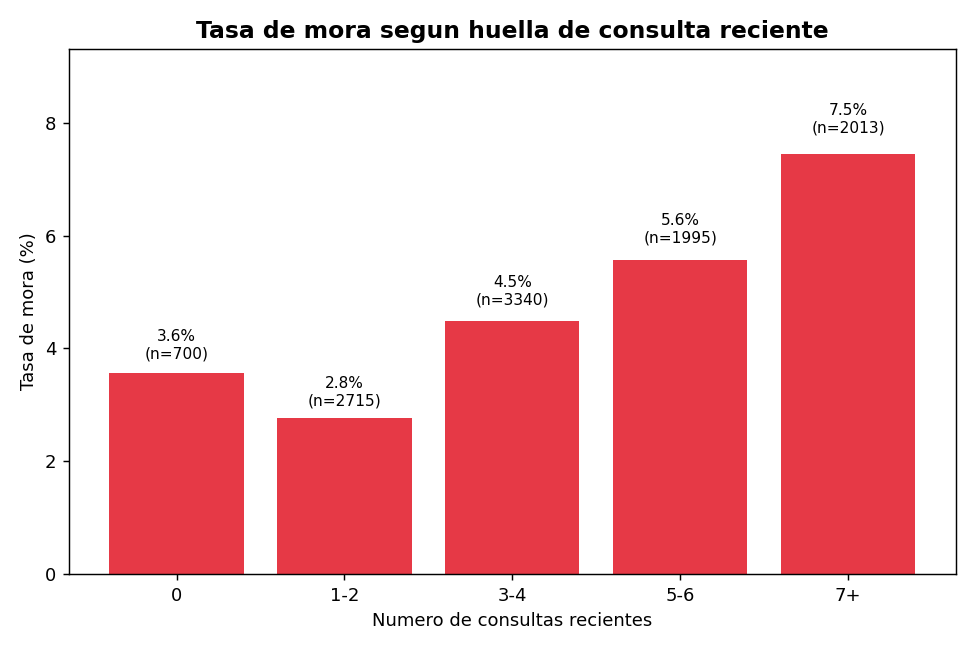

# Análisis de Créditos — Insights de Negocio

**Proyecto MLOps — Ciencia de Datos en Producción**

Este documento complementa el notebook `mlops_pipeline/src/comprension_eda.ipynb`. Aquí se
documenta la narrativa completa: el entendimiento de negocio detrás de cada variable, las
decisiones de limpieza (con su justificación) y los hallazgos del análisis exploratorio, con sus
gráficas e interpretaciones.

No se entregó diccionario de datos junto con la base, por lo que el significado de cada variable
se construyó combinando investigación sobre el negocio crediticio colombiano (centrales de riesgo
tipo DataCrédito) y validación empírica directamente sobre los datos.

---

## 1. Contexto de negocio

Se cuenta con una base de 10.763 créditos otorgados por una entidad financiera, con información
del crédito, del cliente titular y de su comportamiento de pago (`Pago_atiempo`: 1 si pagó a
tiempo, 0 si cayó en mora). El objetivo es limpiar la información con criterio de negocio,
entender las variables y generar insights accionables, y desde este entregable, construir un
pipeline de modelado reproducible (`ft_engineering.py` → `model_training_evaluation.py` →
`model_deploy.py` → `model_monitoring.py`).

En Colombia, cuando una entidad evalúa un crédito consulta una **central de riesgo** (la más
conocida es DataCrédito Experian). Esta central centraliza el comportamiento financiero de una
persona en *todo* el sistema (bancos, cooperativas, comercio), no solo con la entidad que evalúa
el crédito. De ahí salen variables clave de esta base:

- **Score de central de riesgo** (`puntaje_datacredito`): sintetiza el historial de pagos del
  cliente en un número, típicamente en un rango de 150 a 950/999 puntos.
- **Huella de consulta** (`huella_consulta`): cada vez que una entidad consulta el historial de una
  persona queda una marca. No afecta el score directamente, pero es una señal cualitativa de
  riesgo: muchas consultas en poco tiempo sugieren búsqueda urgente de crédito.
- **Créditos vigentes y por sector**: nivel de apalancamiento actual del cliente en todo el
  sistema, no solo con esta entidad.
- **Ingresos reportados a la central**: en Colombia, el ingreso de un empleado formal lo reporta
  el empleador; el de un independiente depende de fuentes más limitadas.

---

## 2. Limpieza de datos: hallazgos y decisiones

Se evitó imputar o corregir datos sin evidencia. Cada decisión se validó empíricamente antes de
aplicarse. Estas decisiones ya están implementadas como transformers de scikit-learn en
`ft_engineering.py` (`ColumnasIrrelevantes`, `ColumnasNulos`, `Outliers`, `Imputacion`,
`NuevasVariables`).

### Hallazgo 1 — `puntaje`: fuga de información (data leakage)

Correlación con `Pago_atiempo`: 0.92 (extrema). Correlación con `puntaje_datacredito` (score
real): 0.09 (casi nula). El valor "default" (95,227787) nunca aparece en un crédito en mora.
**Decisión:** se descarta como predictor.

### Hallazgo 2 — `tendencia_ingresos`: 58 valores corruptos

Números sueltos en vez de categoría. Se descartó corrimiento de columnas. **Decisión:** convertir
a nulo.

### Hallazgo 3 — Nulos en variables de saldo

Patrón jerárquico: `saldo_mora_codeudor` (99.97% de los no-nulos son 0 → imputar con 0),
`saldo_principal` (derivable con identidad contable cuando hay evidencia), 156 filas con los 4
campos nulos (sin evidencia → imputación con mediana como último recurso para permitir
entrenamiento del modelo).

### Hallazgo 4 — Nulos "genuinos" en ingresos de buró (asociados a independientes)

~2.930 clientes sin info de ingresos pero SÍ con score. Asociado a ser Independiente (56% vs 30%).
**Decisión:** no imputar, crear `tiene_info_ingresos_buro`.

### Hallazgo 5 — `puntaje_datacredito` nulo (6 filas)

Clientes sin ningún rastro previo (primer crédito). **Decisión:** imputar con la mediana general
(necesario para el entrenamiento del modelo).

### Hallazgo 6 — Códigos raros de `tipo_credito`

Código 6 (n=21): 42.86% de mora, ~10x el promedio. **Decisión:** variable agrupada
`tipo_credito_agrupado`, códigos 7+68 fusionados en "Otros".

### Hallazgo 7 — Bloque de 150 filas con edad y salario distorsionados

Edad: patrón exacto (-100 años) → se corrige. Salario/otros préstamos: factores de escala
inconsistentes (29.4x vs 16.1x) → no se corrigen, se marca `lote_datos_sospechoso`.

### Hallazgo 8 — `salario_cliente` inválido (35 filas)

24 filas con salario=0 pero crédito real desembolsado; 11 filas con cuota > salario. **Decisión:**
convertir a nulo únicamente en esas 35 filas.

---

## 3. Variables derivadas

| Variable | Fórmula / lógica |
|---|---|
| `tiene_info_ingresos_buro` | `promedio_ingresos_datacredito` no nulo |
| `tipo_credito_agrupado` | `tipo_credito`, con 7+68 fusionados en "Otros" |
| `lote_datos_sospechoso` | Flag del bloque de 150 filas con datos distorsionados |
| `ratio_cuota_ingreso` | `cuota_pactada / salario_cliente` |
| `nivel_endeudamiento` | `(total_otros_prestamos + saldo_total) / salario_cliente` |
| `rango_edad` | Bins: 18-25, 26-35, 36-45, 46-55, 56+ |
| `rango_puntaje_datacredito` | Bins según rangos de referencia de la industria |

---

## 4. Análisis Exploratorio (EDA)

### 4.1 Distribución del target

95.3% paga a tiempo, 4.7% cae en mora. Clases desbalanceadas.

### 4.2 Puntaje Datacrédito vs. mora

Relación monotónica y limpia. Mejor predictor individual encontrado.

### 4.3 Capacidad de pago (cuota/ingreso) vs. mora

Hallazgo contraintuitivo: sin relación clara (4.2%-5.3% en todos los quintiles).

### 4.4 Tipo laboral e info de ingresos en buró vs. mora

Independientes y sin info en buró: mayor mora.

### 4.5 Tipo de crédito vs. mora

Confirma la alerta del tipo_credito 6 (42.9% de mora).

### 4.6 Edad vs. mora

Jóvenes (18-25): mora más alta, decrece con la edad.

### 4.7 Huella de consulta vs. mora

Relación monotónica creciente: más consultas = más mora.

---

## 5. Próximos pasos (pipeline MLOps)

1. `ft_engineering.py`: limpieza + variables derivadas → conjuntos de train/test (en curso, PR1-PR3).
2. `heuristic_model.py`: modelo de reglas base como piso mínimo a superar.
3. `model_training_evaluation.py`: entrenamiento, comparación y validación de modelos ML
   (performance, consistency, scalability).
4. `model_deploy.py` / `model_evaluation.py` / `model_monitoring.py`: despliegue, métricas en
   producción y monitoreo de data drift.
