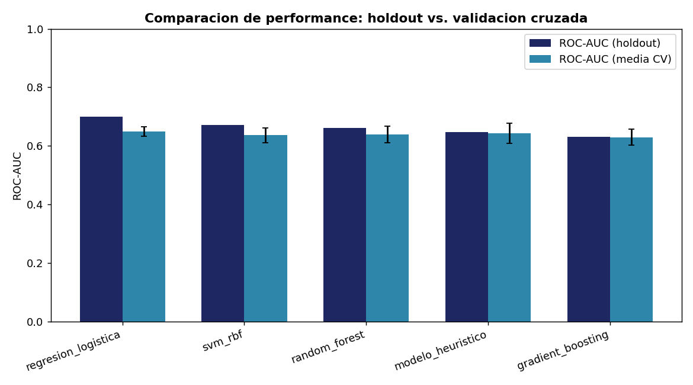
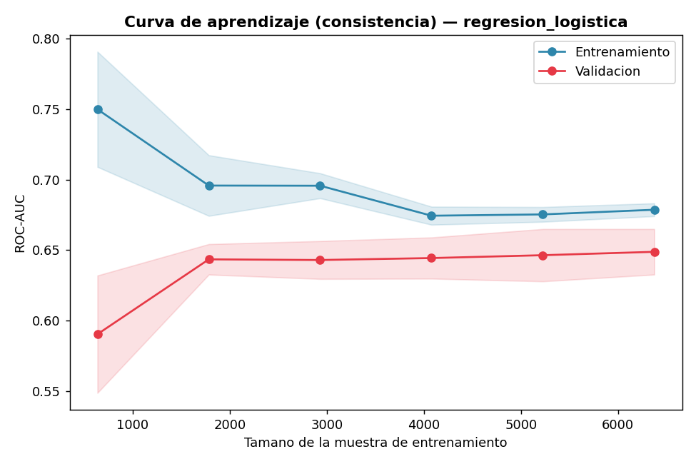
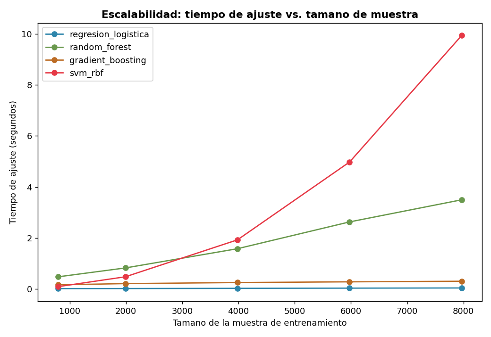
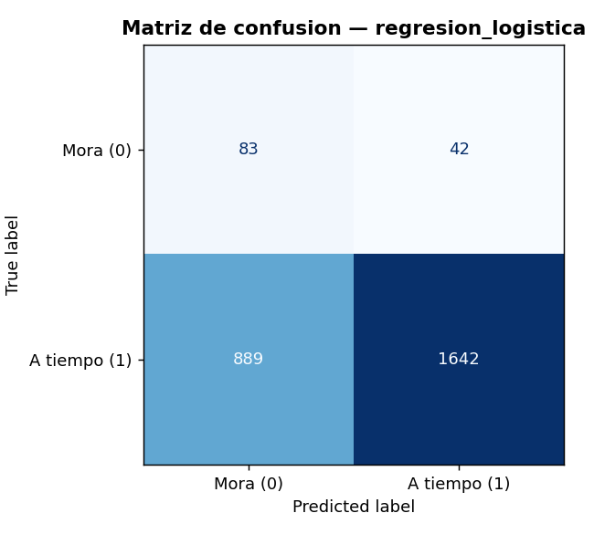
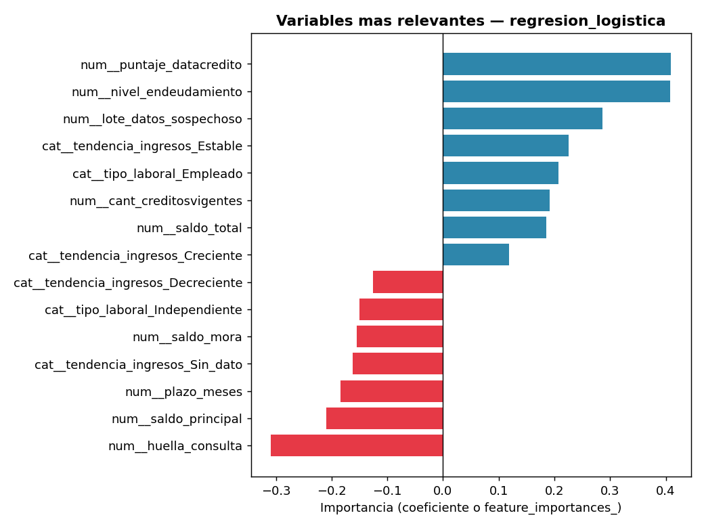

# Proyecto MLOps — Análisis y Predicción de Riesgo de Crédito

**Ciencia de Datos en Producción — Entregable 3**
Pipeline reproducible de extremo a extremo: desde datos crudos hasta un modelo de riesgo de
crédito entrenado, comparado y evaluado con criterios de negocio.

---

## Contexto de negocio

Entidad financiera que necesita predecir `Pago_atiempo` (1 = paga a tiempo, 0 = cae en mora) para
créditos de consumo nuevos, a partir de información del crédito y del historial del cliente en la
central de riesgo. Base de 10.763 créditos, sin diccionario de datos — el entendimiento de cada
variable se construyó combinando investigación del negocio crediticio colombiano y validación
empírica (ver `analisis_insights.md` y `mlops_pipeline/src/comprension_eda.ipynb`).

## Estructura del repositorio

```
Proyecto-Mlops/
├── mlops_pipeline/src/
│   ├── Cargar_datos.ipynb            # lectura del CSV fuente
│   ├── comprension_eda.ipynb         # EDA completo, 8 hallazgos de limpieza
│   ├── ft_engineering.py             # limpieza + variables derivadas + train/test
│   ├── heuristic_model.py            # modelo de reglas de negocio (baseline)
│   ├── model_training_evaluation.py  # entrenamiento, comparacion y evaluacion de modelos
│   └── config.json
├── tests/                            # pruebas unitarias (pytest)
├── graficas/
│   ├── *.png                         # 7 graficas del EDA (Entregable 2)
│   └── modelos/                      # 5 graficas de la comparacion de modelos
├── .github/workflows/build.yml       # CI: pytest + SonarCloud en cada push/PR
├── sonar-project.properties
├── Base_de_datos.csv
├── requirements.txt
├── setup.bat
└── readme.md
```

## Flujo de colaboración (Git)

`master` → `developer` → ramas `feature*` (una por unidad de trabajo). Cada pieza del pipeline se
desarrolló en su propia rama, con Pull Request hacia `developer` revisado por un compañero antes
de integrarse. SonarCloud corre automáticamente en cada push/PR (calidad, seguridad, cobertura).

## Cómo correrlo

```powershell
.\setup.bat                          # crea el entorno virtual e instala requirements.txt
venv\Scripts\Activate.ps1
pytest tests\ -v --cov=mlops_pipeline --cov-report=term
```

---

## El pipeline, paso a paso

### 1. `comprension_eda.ipynb` — Entendimiento y limpieza

8 hallazgos documentados con evidencia (no supuestos), entre ellos:
- **`puntaje` tiene fuga de información** (correlación 0.92 con el target, 0.09 con el score real)
  → se descarta como predictor.
- **Bloque de 150 filas con edad inflada +100 años** (patrón exacto) → se corrige; el salario del
  mismo bloque no tiene un factor de escala consistente → se marca como no confiable.
- **Nulos en ingresos de buró ligados a informalidad laboral** (56% independientes vs 30%) → se
  documenta como hallazgo de negocio, no se imputa.

Detalle completo en `analisis_insights.md`.

### 2. `ft_engineering.py` — Limpieza y variables derivadas

Pipeline de scikit-learn (`ColumnasNulos` → `Outliers` → `Imputacion` → `NuevasVariables` →
`ToCategory` → `EliminarCategorias` → `ColumnasIrrelevantes`), con `build_features(df)` como punto
de entrada: separa `X_train`/`X_test`/`y_train`/`y_test` (75/25, estratificado).

Variables derivadas: `tiene_info_ingresos_buro`, `tipo_credito_agrupado`, `ratio_cuota_ingreso`,
`nivel_endeudamiento`, `lote_datos_sospechoso`. Ajustes de revisión por pares: se elimina
`capital_prestado` (redundante con `cuota_pactada`, correlación 0.76) y `saldo_mora_codeudor`
(varianza casi nula); se filtra `tipo_credito` a los códigos mayoritarios (4 y 9).

**22 pruebas · 98% de cobertura.**

### 3. `heuristic_model.py` — Modelo heurístico (piso sin ML)

`ModeloHeuristicoRiesgo`, compatible con sklearn (`BaseEstimator` + `ClassifierMixin`), combina 4
señales ya validadas en el EDA (score bajo, huella de consulta alta, edad baja, sin info de
ingresos en buró) en percentiles de riesgo, sin ningún algoritmo de aprendizaje automático. Sirve
de piso mínimo que cualquier modelo de ML debe superar.

**15 pruebas · 96% de cobertura.**
**ROC-AUC en holdout: 0.647 · Lift sobre revisión aleatoria: 1.80x**

### 4. `model_training_evaluation.py` — Entrenamiento y comparación

Compara 5 candidatos —el heurístico + Regresión Logística, Random Forest, HistGradientBoosting y
SVM (RBF)— usando `build_model` y `summarize_classification`, con `class_weight="balanced"` por
el desbalance de clases (95.3% / 4.7%). Se eligieron estos 4 algoritmos de ML a propósito (no son
"los únicos posibles"): cada uno aporta un contraste distinto — lineal/interpretable, no-lineal de
árboles, boosting (suele ganar en datos tabulares) y SVM (contraste deliberado de escalabilidad).

**Resultados en holdout (test set, nunca visto durante entrenamiento):**

| Modelo | ROC-AUC holdout | ROC-AUC CV (media ± std) | Precision mora | Recall mora | Tiempo de ajuste |
|---|---|---|---|---|---|
| **Regresión Logística** 🏆 | **0.700** | 0.649 ± 0.016 | 0.085 | 0.664 | 0.04 s |
| SVM (RBF) | 0.672 | 0.636 ± 0.025 | 0.094 | 0.560 | 9.99 s |
| Random Forest | 0.660 | 0.639 ± 0.028 | 0.000* | 0.000* | 3.41 s |
| Modelo heurístico | 0.647 | 0.643 ± 0.035 | 0.085 | 0.360 | 0.01 s |
| Gradient Boosting | 0.631 | 0.630 ± 0.027 | 0.141 | 0.168 | 0.32 s |

\* *Con el umbral 0.5 por defecto, Random Forest nunca predice la clase minoritaria — justo el
problema que resuelve el umbral de decisión optimizado por costo de negocio (ver abajo).*



**Ganó la Regresión Logística** — no el modelo más complejo. Consistente con el EDA: las señales
de riesgo (score, huella de consulta, edad) tienen relaciones monotónicas y aproximadamente
lineales con la mora, que un modelo lineal captura bien.

**Ejes de evaluación:**

**Performance** — tabla comparativa arriba (holdout + validación cruzada de 5 folds).

**Consistency** — curva de aprendizaje del ganador: el ROC-AUC de validación se estabiliza a
partir de ~4.000 muestras (0.645 → 0.651), sin señales de sobreajuste.



**Scalability** — tiempo de ajuste vs. tamaño de muestra: la Regresión Logística escala casi
plano; el **SVM crece de forma claramente superlineal** (~0.09s → 9.99s, ~110x más lento con solo
10x más datos) — el contraste esperado para ese algoritmo.



**Matriz de confusión del modelo ganador:**



**Importancia de variables** (coeficientes de la Regresión Logística ganadora):



Todos los signos son coherentes con el EDA: score alto y más créditos vigentes reducen el riesgo;
huella de consulta alta, ser independiente e ingresos decrecientes lo aumentan.
*(Nota de proceso: `tiene_info_ingresos_buro` se excluyó del modelo — coincidía en 99.4% de las
filas con la categoría `tendencia_ingresos_Sin_dato`, y mantener ambas generaba coeficientes
inestables/contradictorios por multicolinealidad; se conservó la que aporta más matiz.)*

**Mejoras de ingeniería aplicadas:**
1. Un único `Pipeline` (preprocesador + modelo) por candidato — evita fuga de datos entre folds.
2. Validación cruzada estratificada (`StratifiedKFold`, 5 folds) para elegir el modelo, no solo un
   train/test suelto.
3. Importancia de variables / coeficientes del modelo ganador, con manejo honesto de
   multicolinealidad (arriba).
4. Umbral de decisión optimizado por costo de negocio (no 0.5 fijo) — un falso negativo (prestarle
   a quien no paga) se pondera 5x más caro que un falso positivo (negar un crédito bueno), ajustable
   según el apetito de riesgo real.
5. El mejor modelo se guarda con `joblib`, listo para `model_deploy.py`.

**60 pruebas · 99% de cobertura** (diseñadas para correr en segundos: el flujo completo con los 5
candidatos —incluyendo SVM— tarda ~2 minutos y se corre manualmente, no en cada `pytest`).

---

## Validación y CI/CD

- **SonarCloud**: calidad de código, seguridad, cobertura e integridad validadas automáticamente
  en cada Pull Request (`.github/workflows/build.yml`).
- **pytest**: 97 pruebas unitarias en total entre los 3 módulos del pipeline, corriendo en
  segundos.
- Cada decisión de limpieza/negocio está documentada con la evidencia que la respalda — nunca se
  imputó ni se descartó nada sin poder mostrar por qué.

## Pendiente

- `model_deploy.py` — publicar el mejor modelo en un endpoint para predicciones por lote.
- `model_evaluation.py` — tablero de métricas del modelo ya desplegado.
- `model_monitoring.py` — monitoreo de *data drift* en producción.
- Tag de versión (`developer` → `master`) una vez el pipeline completo esté estable.
