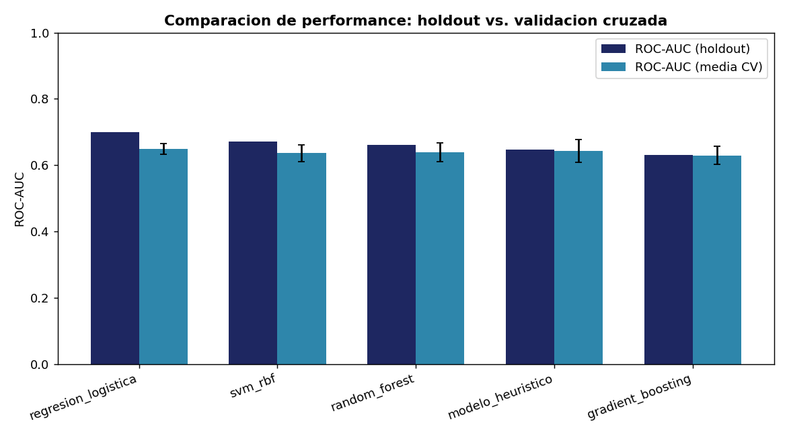
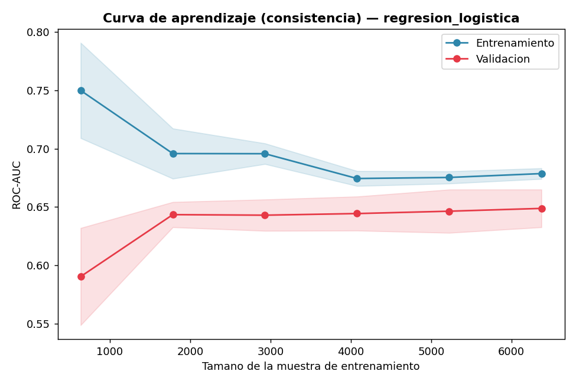
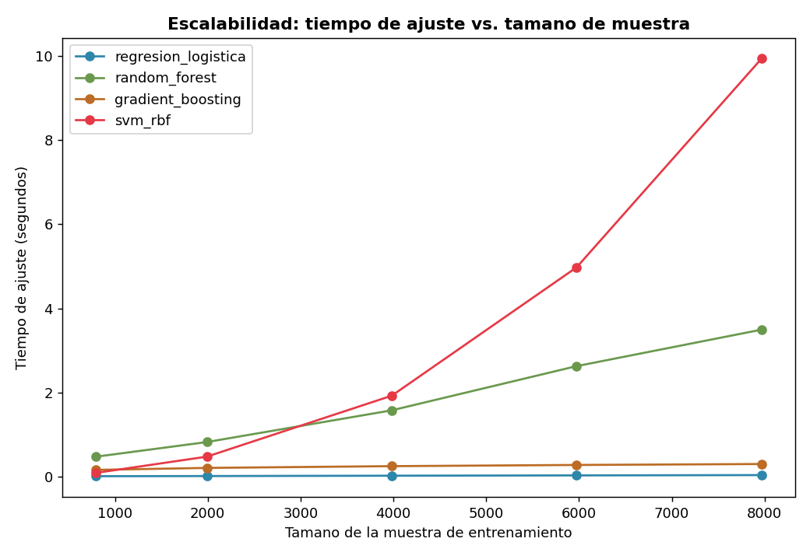
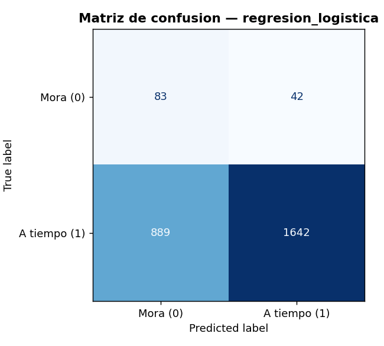
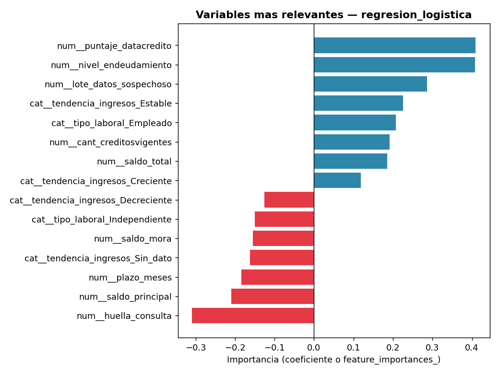

# Proyecto MLOps — Análisis y Predicción de Riesgo de Crédito

**Ciencia de Datos en Producción — Entregable 3**
Pipeline reproducible de extremo a extremo: desde datos crudos hasta un modelo de riesgo de
crédito entrenado, comparado, desplegado como servicio, y monitoreado en producción.

---

## Contexto de negocio

Entidad financiera que necesita predecir `Pago_atiempo` (1 = paga a tiempo, 0 = cae en mora) para
créditos de consumo nuevos, a partir de información del crédito y del historial del cliente en la
central de riesgo. Base de 10.763 créditos, sin diccionario de datos — el entendimiento de cada
variable se construyó combinando investigación del negocio crediticio colombiano y validación
empírica (ver `analisis_insights.md` y `mlops_pipeline/src/comprension_eda.ipynb`).

## Estructura del repositorio

```
Proyecto-Mlops/
├── mlops_pipeline/src/
│   ├── Cargar_datos.ipynb            # lectura del CSV fuente
│   ├── comprension_eda.ipynb         # EDA completo, 8 hallazgos de limpieza
│   ├── ft_engineering.py             # limpieza + variables derivadas + train/test
│   ├── heuristic_model.py            # modelo de reglas de negocio (baseline)
│   ├── model_training_evaluation.py  # entrenamiento, comparacion y evaluacion de modelos
│   ├── model_deploy.py               # API (FastAPI) para predicciones por lote
│   ├── model_evaluation.py           # pestana de metricas del modelo desplegado
│   ├── model_monitoring.py           # deteccion de data drift
│   └── config.json
├── tests/                            # 83 pruebas unitarias (pytest)
├── graficas/
│   ├── *.png                         # 7 graficas del EDA (Entregable 2)
│   └── modelos/                      # 5 graficas de la comparacion de modelos
├── logs/                             # log de predicciones reales del API (se genera solo)
├── .github/workflows/build.yml       # CI: pytest + SonarCloud en cada push/PR
├── Dockerfile                        # imagen liviana para servir el modelo
├── requirements-deploy.txt           # dependencias minimas para la imagen de Docker
├── sonar-project.properties
├── Base_de_datos.csv
├── requirements.txt
├── setup.bat
└── readme.md
```

## Flujo de colaboración (Git)

`master` → `developer` → ramas `feature*` (una por unidad de trabajo). Cada pieza del pipeline se
desarrolló en su propia rama, con Pull Request hacia `developer` revisado por un compañero antes
de integrarse. SonarCloud corre automáticamente en cada push/PR (calidad, seguridad, cobertura).

## Cómo correrlo

```powershell
.\setup.bat                          # crea el entorno virtual e instala requirements.txt
venv\Scripts\Activate.ps1
pytest tests\ -v --cov=mlops_pipeline --cov-report=term
```

---

## El pipeline, paso a paso

### 1. `comprension_eda.ipynb` — Entendimiento y limpieza

8 hallazgos documentados con evidencia (no supuestos), entre ellos:
- **`puntaje` tiene fuga de información** (correlación 0.92 con el target, 0.09 con el score real)
  → se descarta como predictor.
- **Bloque de 150 filas con edad inflada +100 años** (patrón exacto) → se corrige; el salario del
  mismo bloque no tiene un factor de escala consistente → se marca como no confiable.
- **Nulos en ingresos de buró ligados a informalidad laboral** (56% independientes vs 30%) → se
  documenta como hallazgo de negocio, no se imputa.

Detalle completo en `analisis_insights.md`.

### 2. `ft_engineering.py` — Limpieza y variables derivadas

Pipeline de scikit-learn (`ColumnasNulos` → `Outliers` → `Imputacion` → `NuevasVariables` →
`ToCategory` → `EliminarCategorias` → `ColumnasIrrelevantes`), con `build_features(df)` como punto
de entrada: separa `X_train`/`X_test`/`y_train`/`y_test` (75/25, estratificado).

Variables derivadas: `tiene_info_ingresos_buro`, `tipo_credito_agrupado`, `ratio_cuota_ingreso`,
`nivel_endeudamiento`, `lote_datos_sospechoso`. Ajustes de revisión por pares: se elimina
`capital_prestado` (redundante con `cuota_pactada`, correlación 0.76) y `saldo_mora_codeudor`
(varianza casi nula); se filtra `tipo_credito` a los códigos mayoritarios (4 y 9).

### 3. `heuristic_model.py` — Modelo heurístico (piso sin ML)

`ModeloHeuristicoRiesgo`, compatible con sklearn (`BaseEstimator` + `ClassifierMixin`), combina 4
señales ya validadas en el EDA (score bajo, huella de consulta alta, edad baja, sin info de
ingresos en buró) en percentiles de riesgo, sin ningún algoritmo de aprendizaje automático. Sirve
de piso mínimo que cualquier modelo de ML debe superar.

**ROC-AUC en holdout: 0.647 · Lift sobre revisión aleatoria: 1.80x**

### 4. `model_training_evaluation.py` — Entrenamiento y comparación

Compara 5 candidatos —el heurístico + Regresión Logística, Random Forest, HistGradientBoosting y
SVM (RBF)— usando `build_model` y `summarize_classification`, con `class_weight="balanced"` por
el desbalance de clases (95.3% / 4.7%).

**Resultados en holdout (test set, nunca visto durante entrenamiento):**

| Modelo | ROC-AUC holdout | ROC-AUC CV (media ± std) | Precision mora | Recall mora | Tiempo de ajuste |
|---|---|---|---|---|---|
| **Regresión Logística** 🏆 | **0.700** | 0.649 ± 0.016 | 0.085 | 0.664 | 0.04 s |
| SVM (RBF) | 0.672 | 0.636 ± 0.025 | 0.094 | 0.560 | 9.99 s |
| Random Forest | 0.660 | 0.639 ± 0.028 | 0.000* | 0.000* | 3.41 s |
| Modelo heurístico | 0.647 | 0.643 ± 0.035 | 0.085 | 0.360 | 0.01 s |
| Gradient Boosting | 0.631 | 0.630 ± 0.027 | 0.141 | 0.168 | 0.32 s |

\* *Con el umbral 0.5 por defecto, Random Forest nunca predice la clase minoritaria — justo el
problema que resuelve el umbral de decisión optimizado por costo de negocio.*



**Ganó la Regresión Logística** — no el modelo más complejo. Consistente con el EDA: las señales
de riesgo tienen relaciones monotónicas y aproximadamente lineales con la mora.

**Consistency** — curva de aprendizaje: el ROC-AUC de validación se estabiliza a partir de ~4.000
muestras, sin señales de sobreajuste.



**Scalability** — el SVM crece de forma claramente superlineal (~0.09s → 9.99s, ~110x más lento
con solo 10x más datos) — el contraste esperado para ese algoritmo.





**Importancia de variables** (coeficientes de la Regresión Logística ganadora) — todos los signos
son coherentes con el EDA: score alto y más créditos vigentes reducen el riesgo; huella de
consulta alta, ser independiente e ingresos decrecientes lo aumentan.



*(Nota de proceso: `tiene_info_ingresos_buro` se excluyó del modelo — coincidía en 99.4% de las
filas con la categoría `tendencia_ingresos_Sin_dato`, y mantener ambas generaba coeficientes
inestables por multicolinealidad.)*

**Mejoras de ingeniería aplicadas:** Pipeline único (evita fuga de datos entre folds), validación
cruzada estratificada (5 folds), importancia de variables con manejo honesto de multicolinealidad,
umbral de decisión optimizado por costo de negocio (falso negativo pondera 5x más que falso
positivo), modelo guardado con `joblib`.

### 5. `model_deploy.py` — Servicio de predicción (API)

Publica el mejor modelo como un servicio **FastAPI** — no una interfaz visual (Streamlit, etc.),
sino infraestructura para que otros sistemas consuman el modelo por lote, tal como lo describe el
enunciado ("una app que permita disponibilizar dicho objeto... endpoint... por batch").

- `GET /salud` — confirma que el modelo cargó bien.
- `POST /predecir_lote` — recibe un lote de créditos nuevos (datos crudos) y devuelve predicción +
  probabilidad de cada uno. Encadena automáticamente: datos crudos → limpieza
  (`ft_engineering.pipeline_basemodel`, ajustada una sola vez con el histórico) → modelo entrenado.
- Clientes con `tipo_credito` no soportado por el modelo nunca desaparecen de la respuesta — se
  marcan explícitamente con un motivo, para no desalinear los índices del lote.
- Cada predicción queda registrada en `logs/predicciones_log.csv` (insumo para evaluación y
  monitoreo).

**Empaquetado en Docker** (`Dockerfile` + `requirements-deploy.txt`, dependencias mínimas — sin
Jupyter/matplotlib, solo lo necesario para servir):

```powershell
docker build -t riesgo-credito-api .
docker run -d -p 8000:8000 `
  -v "${PWD}/mejor_modelo_final.joblib:/app/mejor_modelo_final.joblib" `
  -v "${PWD}/Base_de_datos.csv:/app/Base_de_datos.csv" `
  --name api-credito riesgo-credito-api
```

Verificado de punta a punta (no solo con pruebas automatizadas): build exitoso, contenedor
corriendo, y una petición real `POST /predecir_lote` respondiendo `200 OK` con una predicción y
probabilidad coherente (`probabilidad_mora: 0.574`).

### 6. `model_evaluation.py` — Pestaña de métricas del modelo desplegado

Genera un reporte HTML autocontenido (sin servidor ni dependencias externas para verlo — se abre
directo en el navegador) con dos secciones:
1. **Desempeño del modelo desplegado** contra un conjunto de evaluación con verdad conocida — carga
   el mismo `.joblib` que sirve `model_deploy.py`, para detectar si alguien lo reemplazó sin avisar.
2. **Actividad real del API** — resumen del log de predicciones: cuántas peticiones ha recibido,
   qué fracción se marcó como alto riesgo, distribución de probabilidades.

### 7. `model_monitoring.py` — Detección de *data drift*

Compara la distribución de los datos que están llegando de verdad al API (el log de
`model_deploy.py`) contra la distribución de los datos de entrenamiento, para detectar si el mundo
real se está alejando de lo que el modelo aprendió — sin necesitar aún las etiquetas reales de pago.

- **Variables numéricas:** prueba de Kolmogorov-Smirnov (no asume normalidad).
- **Variables categóricas:** diferencia máxima de proporción entre categorías.
- Genera un reporte HTML con gráficas de las distribuciones que sí dispararon alerta.

Validado con un caso de drift forzado (edad +40 años, salario ×0.3, 100% independientes): las 3
columnas alteradas se detectaron correctamente, sin falsos positivos en el caso sin cambios reales.

*Sobre la periodicidad que pide el enunciado: este módulo expone la función de cómputo
(`calcular_drift`), reutilizable cuantas veces se necesite — la periodicidad real (correrlo cada
noche, por ejemplo) la define quien lo agende (cron, un scheduler, una tarea programada de GitHub
Actions), no el módulo en sí.*

---

## Validación y CI/CD

- **SonarCloud**: calidad de código, seguridad, cobertura e integridad validadas automáticamente
  en cada Pull Request (`.github/workflows/build.yml`).
- **83 pruebas unitarias** entre los 6 módulos de código del pipeline, **94% de cobertura
  combinada**, corriendo en segundos.
- Cada decisión de limpieza/negocio está documentada con la evidencia que la respalda — nunca se
  imputó, descartó, ni desplegó nada sin poder mostrar por qué.

## Conclusiones y recomendaciones de negocio

- El **score de la central de riesgo** sigue siendo, por lejos, la señal más confiable disponible
  — cualquier ajuste de política de crédito debería apoyarse primero en él.
- La **huella de consulta reciente** es una señal de alerta temprana barata de obtener: vale la
  pena monitorearla incluso antes de tener el desenlace real del crédito.
- El desempeño (ROC-AUC ≈ 0.70) es **modesto pero honesto**: refleja el techo real de lo que estos
  datos permiten predecir, no una debilidad del modelado — bancos con mejor desempeño usan fuentes
  de datos (verificación de ingresos, historial bancario completo) que esta base no tiene.
- Por eso, el modelo se recomienda como **apoyo a la decisión y priorización de revisión manual**,
  no como aprobación/negación automática — la misma conclusión honesta a la que llegó el análisis
  más riguroso que revisamos de un compañero del curso.
